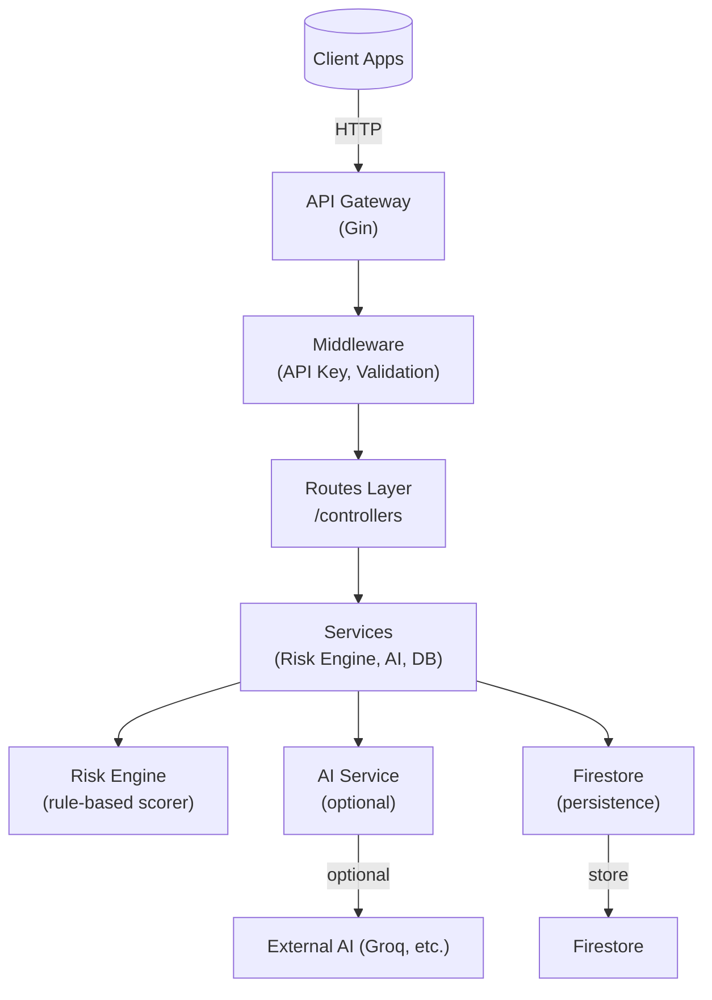

# 🛡️ Asguard — AI-Powered Fraud Detection

  

Asguard is a real-time fraud detection engine combining rule-based scoring with AI-enhanced analysis. It provides an API for transaction analysis, a configurable risk engine, and integration points for databases (Firestore) and AI services.

Contents

- Overview
- Architecture (with diagrams)
- Quickstart
- Local development
- Configuration
- API reference (high-level)
- Project layout
- Testing & CI
- Contributing
- License

---

## Overview

Asguard scores transactions using a weighted rule engine and optionally escalates higher-risk cases to an AI analysis service. The system is designed to be lightweight, modular, and easy to run locally.

Use cases:
- Real-time risk scoring for payments
- Pre-authorization fraud checks
- Triaging transactions for manual review

---

## Architecture (high level)

Mermaid architecture diagram:



Component summary:
- `main.go`: application entry, env loading, router setup
- `routes/`: HTTP routes and request binding
- `middleware/`: API key enforcement, validation
- `services/risk_engine.go`: scoring algorithm
- `services/ai_service.go`: AI integration point
- `services/db/firestore.go`: Firestore adapter

---

## Quickstart (local)

Prerequisites:
- Go 1.25+
- Git
- A Firebase project (for Firestore) or set DB to noop for quick dev

Steps:

```bash
git clone <repo-url>
cd asguard/backend
go mod download
# place your Firebase JSON at backend/config/asguard.json
export ASGUARD_API_KEY=your_api_key_here
export FIREBASE_CREDENTIALS_PATH=./config/asguard.json
go run main.go
```

Health-check:

```bash
curl http://localhost:8081/health
# expected: {"status":"asguard health running"}
```

---

## Local development

- Use `go run main.go` during development.
- To build a binary: `go build -o asguard.exe`.
- Keep `backend/config/asguard.json` secure — do not commit credentials.

Project structure (backend-focused):

- backend/
  - main.go
  - routes/
  - middleware/
  - services/
    - ai_service.go
    - risk_engine.go
    - db/firestore.go
  - config/
    - asguard.json (gitignored)

---

## Configuration

Required environment variables:

- `ASGUARD_API_KEY` — API key for protected endpoints
- `FIREBASE_CREDENTIALS_PATH` — path to the service account JSON
- `PORT` — optional, defaults to `8081`

Example `.env` (backend/):

```env
ASGUARD_API_KEY=super-secret-key
FIREBASE_CREDENTIALS_PATH=./config/asguard.json
PORT=8081
```

---

## API (high level)

Base URL: `http://localhost:8081`

- `GET /health` — service health
- `POST /analyze` — submit a transaction for scoring (requires `x-api-key` header)

Authentication: provide `x-api-key` header for protected endpoints.

Request/response examples are in the `routes/` handlers — inspect [backend/routes/routes.go](backend/routes/routes.go) to see exact bindings.

---

## Testing & CI

- Unit tests: add tests alongside packages — e.g., `services/risk_engine_test.go`.
- Run: `go test ./...`
- Lint/format: `gofmt -w .` and consider `golangci-lint` in CI.

### CI

A minimal GitHub Actions workflow is included at `.github/workflows/ci.yml` to run tests, `gofmt` and `go vet` on pushes and pull requests. Adjust the workflow to add linters or caching as needed.

### Dev Docker

A `docker-compose.dev.yml` is provided for local development. It builds the `backend` service and mounts the source so you can iterate without rebuilding the image repeatedly. Example:

```bash
docker compose -f docker-compose.dev.yml up --build
```

Stop it with `docker compose down`.

---

## Contributing

We welcome contributions. See [CONTRIBUTING.md](CONTRIBUTING.md) for full guidelines.

Short checklist:
- Open an issue to discuss non-trivial changes
- Create a feature branch named `feat/your-feature` or `fix/issue-123`
- Keep commits small and focused
- Run `go test ./...` and linters locally before PR

---

## Troubleshooting

- If Firestore auth fails: verify `FIREBASE_CREDENTIALS_PATH` and the JSON contents
- If routes return 401: check `ASGUARD_API_KEY` header value

---

## License

This project is MIT licensed. See LICENSE for details.
