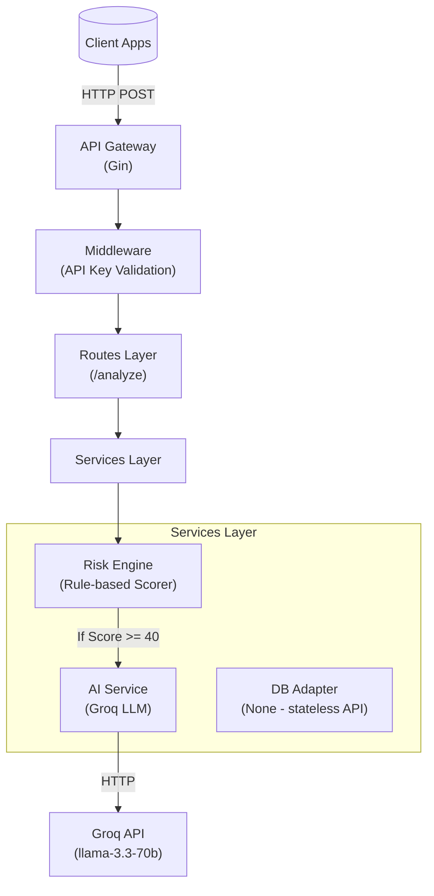

# Asguard — AI-Powered Fraud Detection

  

Asguard is a real-time fraud detection engine combining rule-based scoring with AI-enhanced analysis. It provides an API for transaction analysis and a configurable risk engine with AI integration.

## Table of Contents

- [Overview](#overview)
- [Key Features](#key-features)
- [Architecture & Request Flow](#architecture--request-flow)
- [Prerequisites](#prerequisites)
- [Quickstart: Local Development](#quickstart-local-development)
  - [Running with Go](#running-with-go)
  - [Running with Docker](#running-with-docker)
- [Configuration Details](#configuration-details)
- [API Reference](#api-reference)
- [Project Layout](#project-layout)
- [Testing & CI](#testing--ci)
- [Contributing](#contributing)
- [License](#license)

---

## Overview

Asguard scores transactions using a weighted rule engine and optionally escalates higher-risk cases to an AI analysis service. The system is designed to be lightweight, modular, easy to run locally, and highly extensible.

**Primary Use Cases:**

- Real-time risk scoring for payments.
- Pre-authorization fraud checks.
- Triaging suspicious transactions for manual review.

---

## Key Features

- **Rule-Based Scoring:** Configurable, tiered scoring engine based on transaction amount, currency, device, IP, and location.
- **AI Escalation:** Automatically calls an LLM (Groq AI `llama-3.3-70b-versatile`) for transactions crossing a risk threshold (Score >= 40) for a second opinion.
- **RESTful API:** Clean, JSON-based API powered by Gin.
- **API Key Security:** Built-in middleware for endpoint protection.
 - **Dockerized:** Instant local setup via `docker-compose`.

 - **API Key Security:** Built-in middleware for endpoint protection.
 - **Dockerized:** Instant local setup via `docker-compose`.

---

## Architecture & Request Flow

Asguard processes incoming transactions through multiple layers, evaluating rules and communicating with external AI only when necessary.

### High-Level Architecture



### Request Lifecycle

1. **Validation & Auth:** The `APIKeyAuth` middleware validates the `x-api-key`.
2. **Data Binding:** The route handler parses the JSON payload.
3. **Rule Evaluation:** `risk_engine.go` applies weights to transaction properties (Amount, Currency, IP, Device, Location).
4. **AI Gating:** If the rule-based score is ≥ 40 (MEDIUM or HIGH risk), the `ai_service.go` constructs a strict system prompt and queries the Groq API.
5. **Final Designation:** The AI's recommendation (`APPROVE`, `REVIEW`, `BLOCK`) can upgrade the final risk level but cannot downgrade a high-risk label generated by the engine.
6. **Response:** A structured JSON object is returned containing the score, risk level, rule-based reasons, and the AI's detailed summary.

_For an in-depth code walkthrough, please see [ARCHITECTURE.md](ARCHITECTURE.md)._

---

## Prerequisites

To run Asguard locally, you will need:

- **[Go 1.25+](https://go.dev/dl/)**
- **[Git](https://git-scm.com/)**
- **[Docker & Docker Compose](https://www.docker.com/)** (Optional, for containerized local dev)
- **Groq API Key:** Required for the AI-enhanced analysis. Get one at [console.groq.com](https://console.groq.com/).

 - **Groq API Key:** Required for the AI-enhanced analysis. Get one at [console.groq.com](https://console.groq.com/).

---

## Quickstart: Local Development

### Running with Go

1. **Clone the repository:**

   ```bash
   git clone <repo-url>
   cd asguard/backend
   ```

2. **Download modules:**

   ```bash
   go mod download
   ```

3. **Set up environment variables:**
   Create a `.env` file in the `backend/` directory:

   ```env
   ASGUARD_API_KEY=super-secret-key
   GROQ_API_KEY=your_groq_api_key
   PORT=8081
   ```

4. **Start the server:**
   ```bash
   go run main.go
   ```

### Running with Docker

A `docker-compose.dev.yml` file is provided that mounts your local directory into the container, allowing hot-reloading (if configured) and isolated execution.

```bash
cd backend
docker compose -f docker-compose.dev.yml up --build
```

_To stop the container gracefully, press `Ctrl+C` or run `docker compose down`._

---

## Configuration Details

Asguard is configured entirely via environment variables.

| Variable                    | Description                                           | Default | Required? |
| --------------------------- | ----------------------------------------------------- | ------- | --------- |
| `ASGUARD_API_KEY`           | The secret key required by clients to access the API. | None    | Yes       |
| `GROQ_API_KEY`              | API key for the Groq LLM service.                     | None    | Yes       |
| `PORT`                      | The port the Gin server will bind to.                 | `8081`  | No        |

---

## API Reference

### 1. Health Check

Checks if the API is running. No authentication required.

**HTTP Request:**

```http
GET http://localhost:8081/health
```

**Response:**

```json
{
  "status": "asguard health running"
}
```

### 2. Analyze Transaction

Analyzes a payload and returns a calculated risk score and AI analysis.

**HTTP Request:**

```http
POST http://localhost:8081/analyze
```

**Headers:**

- `Content-Type: application/json`
- `x-api-key: <ASGUARD_API_KEY>`

**Request Body:**

```json
{
  "user_id": "user_123",
  "transaction_id": "txn_456",
  "amount": 250000,
  "currency": "USD",
  "ip_address": "192.168.1.5",
  "device_id": "device_789",
  "location": "Lagos, Nigeria"
}
```

**Response:**

```json
{
  "transaction_id": "txn_456",
  "risk_score": 41,
  "risk_level": "MEDIUM",
  "reasons": [
    "High transaction amount (>100k)",
    "Foreign currency transaction (USD)",
    "AI recommends REVIEW: Large USD transaction from Lagos warrants manual review"
  ],
  "ai_triggered": true,
  "ai_confidence": 0.85,
  "ai_recommendation": "REVIEW",
  "ai_fraud_probability": 0.45,
  "ai_summary": "Large USD transaction from Lagos warrants manual review",
  "message": "Transaction analyzed successfully"
}
```

---

## Project Layout

```text
backend/
├── main.go                    # Application entry point, router setup
├── .env                       # Environment secrets (ignored in git)
├── .dockerignore              # Docker build exclusions
├── Dockerfile                 # Production Docker build instructions
├── docker-compose.dev.yml     # Local docker development configuration
├── config/                    # optional config folder (do not store secrets)
├── middleware/
│   └── apikey.go              # Verification middleware for x-api-key
├── routes/
│   └── routes.go              # Endpoint definitions and request binding
└── services/
    ├── ai_service.go          # Groq integration and LLM handling
    ├── risk_engine.go         # Core logic and weighted rule calculations
    └── db/
      └── (none)             # stateless API; persistence removed
```

---

## Testing & CI

### Running Tests Locally

To run the full unit test suite:

```bash
cd backend
go test ./... -v
```

### Linting & Formatting

Ensure your code is properly formatted before committing:

```bash
gofmt -w .
```

### CI Pipeline

The repository includes a GitHub Actions workflow (`.github/workflows/ci.yml`) that automatically runs on pushes and Pull Requests to the main branch. It verifies:

- Go formatting (`gofmt`)
- Static analysis (`go vet`)
- Test completeness (`go test`)

---

## Contributing

We strongly welcome community contributions! Please read our [CONTRIBUTING.md](CONTRIBUTING.md) for detailed instructions on the development workflow, branching strategies, and testing guidelines.

**Quick Checklist:**

- Open an Issue first to discuss large changes.
- Branch off `main` using the format `feat/feature-name` or `fix/bug-name`.
- Ensure all tests pass (`go test ./...`).
- Submit a Pull Request with a clear description.

---

## License

This project is licensed under the [APACHE2.0 License](LICENSE.txt).
